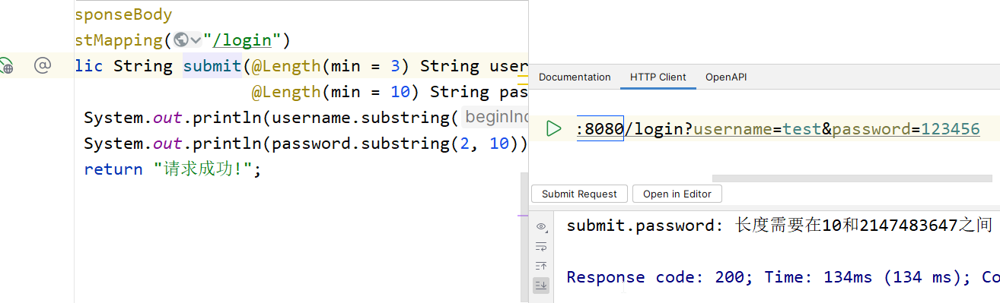
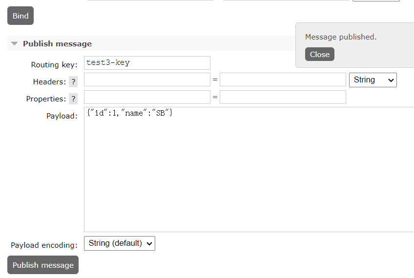

# SpringBoot


## 1 创建项目并配置


### 1.1 在官网创建


### 1.2 直接用idea创建


直接启动即可

最基本的`spring-boot-starter`依赖


导入其他模块也是导入`spring-boot-starter-xxxx`这种名称格式的依赖


现在我们导入SpringMvc相关依赖，SpringBoot为我们提供了包含内置Tomcat服务器的Web模块，我们只需要导入依赖就能直接运行服务器：

```xml
<dependency>
    <groupId>org.springframework.boot</groupId>
    <artifactId>spring-boot-starter</artifactId>
</dependency>

<dependency>
    <groupId>org.projectlombok</groupId>
    <artifactId>lombok</artifactId>
    <optional>true</optional>
</dependency>
<dependency>
    <groupId>org.springframework.boot</groupId>
    <artifactId>spring-boot-starter-test</artifactId>
    <scope>test</scope>
</dependency>

<dependency>
    <groupId>org.springframework.boot</groupId>
    <artifactId>spring-boot-starter-web</artifactId>
</dependency>
```


非常方便可以直接返回JSON对象


​	最后浏览器能够直接得到`application/json`的响应数据，就是这么方便，这都得归功于SpringBoot对应的start帮助我们自动将处理JSON数据的Converter进行了配置，我们不需要再单独去配置Converter了。不过SpringBoot官方默认使用的是`Jackson`和`Gson` 的HttpMessageConverter来进行配置，不是我们之前教程中使用的FastJSON框架。


### 1.3 依赖说明

​	所有的SpringBoot依赖都是`spring-boot-starter-`开头的`spring-boot-starter-xxxx`

```xml
<dependency>
    <groupId>org.springframework.boot</groupId>
    <artifactId>spring-boot-starter</artifactId>
</dependency>

<dependency>
    <groupId>org.projectlombok</groupId>
    <artifactId>lombok</artifactId>
    <optional>true</optional>
</dependency>
<dependency>
    <groupId>org.springframework.boot</groupId>
    <artifactId>spring-boot-starter-test</artifactId>
    <scope>test</scope>
</dependency>

<dependency>
    <groupId>org.springframework.boot</groupId>
    <artifactId>spring-boot-starter-web</artifactId>
</dependency>
```

#### 1.3.1 spring-boot-starter


#### 1.3.2 spring-boot-starter-web

```xml
<dependencies>
  <dependency>
    <groupId>org.springframework.boot</groupId>
    <artifactId>spring-boot-starter</artifactId>
    <version>3.1.5</version>
    <scope>compile</scope>
  </dependency>
  <dependency>
    <groupId>org.springframework.boot</groupId>
    <artifactId>spring-boot-starter-json</artifactId>
    <version>3.1.5</version>
    <scope>compile</scope>
  </dependency>
  <dependency>
    <groupId>org.springframework.boot</groupId>
    <artifactId>spring-boot-starter-tomcat</artifactId>
    <version>3.1.5</version>
    <scope>compile</scope>
  </dependency>
  <dependency>
    <groupId>org.springframework</groupId>
    <artifactId>spring-web</artifactId>
    <version>6.0.13</version>
    <scope>compile</scope>
  </dependency>
  <dependency>
    <groupId>org.springframework</groupId>
    <artifactId>spring-webmvc</artifactId>
    <version>6.0.13</version>
    <scope>compile</scope>
  </dependency>
</dependencies>
```

里面包含了以下内容：

- spring-boot-starter 基础依赖starter
- spring-boot-starter-json 配置JSON转换的starter
- spring-boot-starter-tomcat 内置Tomcat服务器
- spring-web、spring-webmvc 


#### 1.3.3 spring-boot-starter-security

SpringSecurity框架整合：

```xml
<dependency>
    <groupId>org.springframework.boot</groupId>
    <artifactId>spring-boot-starter-security</artifactId>
</dependency>
```

导入依赖后，我们启动项目，当我们访问任意网址都会跳到登陆页面，并且系统提供给我们默认的用户名`user`和密码


#### 1.3.4 spring-boot-starter-thymeleaf

整合thymeleaf框架

```xml
<dependency>
    <groupId>org.springframework.boot</groupId>
    <artifactId>spring-boot-starter-thymeleaf</artifactId>
</dependency>
```

在默认情况下，我们需要在`resources`目录下创建两个目录：

- templates	模板文件
- static	静态资源


所以只要创建了控制层，即使不写任何代码，也会直接访问你写好的index.html为首页


#### 1.3.5 mybatis

整合mybatis和mysql驱动：

```xml
<dependency>
    <groupId>org.mybatis.spring.boot</groupId>
    <artifactId>mybatis-spring-boot-starter</artifactId>
    <version>2.1.0</version>
</dependency>
<dependency>
    <groupId>com.mysql</groupId>
    <artifactId>mysql-connector-j</artifactId>
    <scope>runtime</scope>
</dependency>
```

然后配置信息，在4 JDBC中详解


### 1.4 自定义运行器

项目运行器是Application.java


### 1.5 配置文件

直接在`application.properties`中进行配置编写,或者创建一个`application.yml`文件来配置

```properties
server.port=8080
test.data=100
```

若自定义了测试数据test.data=100，那么可以用`@value`来得到数据

```java
@Controller
public class IndexController {

    @Value("${test.data}")
    int data;

}
```

要保证可以跳转到配置文件


SpringSecurity和SpringBootMvc配置：

```yml
spring:  
  #  Spring Mvc相关配置
  mvc:
    static-path-pattern: /static/**   #静态资源解析地址
  # Spring Security 相关配置
  security:
    filter:
      order: -100 #Spring Security 过滤器优先级
    user:
      name: 'admin'   #默认登录用户名
      password: '123456'   #默认登录密码
      roles:    #默认用户的角色
        - admin
        - user
```


### 1.6 打包运行

#### 1.6.1 jar包


点击此选项，即可以打包


此时，在target文件夹会出现打包好的jar文件


我们cmd进入target文件夹，输入此命令来运行项目

```bash
java -jar _01template-0.0.1-SNAPSHOT.jar
```

所以，只有计算机中存在jre环境，就可以直接运行打包好的springboot项目


#### 1.6.2 war包

更改打包方式

去除掉web依赖中的tomcat依赖

添加servlet依赖

修改主类，继承专用的初始化器

运行Maven 的package指令打包成war包

直接将其部署到Tomcat服务器中，即放入webapps文件夹中，启动服务器即可访问

调试时可以在idea配置tomcat服务器


在SpringBoot3之后，特别对GraalVM进行了支持：

> GraalVM 是一种通用的虚拟机，最初由 Oracle 开发。它支持多种编程语言（例如 Java、JavaScript、Python 等），可以在不同的环境中运行，并提供高性能和低内存消耗。
>
> GraalVM的核心是一个即时编译器，它能够将各种语言的代码直接编译成本地机器码，以获得更高的性能。此外，GraalVM 还提供了一个强大的运行时环境，包括垃圾回收器、即时编译器、线程管理器等，可以提供更好的性能和可扩展性。
>
> GraalVM 的一个重要特性是它的跨语言互操作性。GraalVM 可以使不同语言之间的互操作更加容易。例如，你可以在 Java 代码中直接调用 JavaScript 函数，或者在 JavaScript 代码中直接调用 Java 类。这使得在不同语言之间共享和复用代码变得更加容易。
>
> 总的来说，GraalVM 是一个开创性的技术，可以提供出色的性能和灵活性，同时也为多语言开发提供了更好的支持。它是一个非常有潜力的工具，可以用于构建高效的应用程序和解决方案。


## 2 日志

​	SpringBoot为我们提供了丰富的日志系统，它几乎是开箱即用的。我们在之前学习SSM时，如果不配置日志，就会报错，但是到了SpringBoot阶段之后似乎这个问题就不见了，日志打印得也非常统一，这是为什么呢？

### 2.1 日志门面和日志实现

​	JUL实际上就是一种日志实现，我们可以直接使用JUL为我们提供的日志框架来规范化打印日志。

​	而日志门面，如Slf4j，是把不同的日志系统的实现进行了具体的抽象化，只提供了统一的日志使用接口，使用时只需要按照其提供的接口方法进行调用即可，由于它只是一个接口，并不是一个具体的可以直接单独使用的日志框架，所以最终日志的格式、记录级别、输出方式等都要通过接口绑定的具体的日志系统来实现，这些具体的日志系统就有log4j、logback、java.util.logging等，它们才实现了具体的日志系统的功能。

​	日志门面和日志实现就像JDBC和数据库驱动一样，一个是画大饼的，一个是真的去做饼的。


​	但是现在有一个问题就是，不同的框架可能使用了不同的日志框架，如果这个时候出现众多日志框架并存的情况，我们现在希望的是所有的框架一律使用日志门面（Slf4j）进行日志打印，这时该怎么去解决？我们不可能将其他框架依赖的日志框架替换掉，直接更换为Slf4j吧，这样显然不现实。

​	这时，可以采取类似于偷梁换柱的做法，只保留不同日志框架的接口和类定义等关键信息，而将实现全部定向为Slf4j调用。相当于有着和原有日志框架一样的外壳，对于其他框架来说依然可以使用对应的类进行操作，而具体如何执行，真正的内心已经是Slf4j的了。

​	

所以，SpringBoot为了统一日志框架的使用，做了这些事情：

- 直接将其他依赖以前的日志框架剔除
- 导入对应日志框架的Slf4j中间包
- 导入自己官方指定的日志实现，并作为Slf4j的日志实现层


### 2.2 打印项目日志信息

​	SpringBoot使用的是Slf4j作为日志门面，Logback（[Logback](http://logback.qos.ch/) 是log4j 框架的作者开发的新一代日志框架，它效率更高、能够适应诸多的运行环境，同时天然支持SLF4J）作为日志实现，对应的依赖为：

```xml
<dependency>
    <groupId>org.springframework.boot</groupId>
    <artifactId>spring-boot-starter-logging</artifactId>
</dependency>
```


```xml
<?xml version="1.0" encoding="UTF-8"?>
<configuration>


    <!-- 配置 -->
    <!--  导入其他配置文件，作为预设  -->
    <include resource="org/springframework/boot/logging/logback/defaults.xml" />

    <!--  Appender作为日志打印器配置，这里命名随意  -->
    <!--  ch.qos.logback.core.ConsoleAppender是专用于控制台的Appender  -->
    <appender name="CONSOLE" class="ch.qos.logback.core.ConsoleAppender">
        <encoder>
            <pattern>${CONSOLE_LOG_PATTERN}</pattern>
            <charset>${CONSOLE_LOG_CHARSET}</charset>
        </encoder>
    </appender>

    <!--  指定日志输出级别，以及启用的Appender，这里就使用了我们上面的ConsoleAppender  -->
    <root level="INFO">
        <appender-ref ref="CONSOLE"/>
    </root>

    <!--  ch.qos.logback.core.rolling.RollingFileAppender用于文件日志记录，它支持滚动  -->
    <appender name="FILE" class="ch.qos.logback.core.rolling.RollingFileAppender">
        <encoder>
            <pattern>${FILE_LOG_PATTERN}</pattern>
            <charset>${FILE_LOG_CHARSET}</charset>
        </encoder>
        <!--  自定义滚动策略，防止日志文件无限变大，也就是日志文件写到什么时候为止，重新创建一个新的日志文件开始写  -->
        <rollingPolicy class="ch.qos.logback.core.rolling.SizeAndTimeBasedRollingPolicy">
            <!--  文件保存位置以及文件命名规则，这里用到了%d{yyyy-MM-dd}表示当前日期，%i表示这一天的第N个日志  -->
            <FileNamePattern>log/%d{yyyy-MM-dd}-spring-%i.log</FileNamePattern>
            <!--  到期自动清理日志文件  -->
            <cleanHistoryOnStart>true</cleanHistoryOnStart>
            <!--  最大日志保留时间  -->
            <maxHistory>7</maxHistory>
            <!--  最大单个日志文件大小  -->
            <maxFileSize>10MB</maxFileSize>
        </rollingPolicy>
    </appender>

    <!--  指定日志输出级别，以及启用的Appender，这里就使用了我们上面的ConsoleAppender  -->
    <root level="INFO">
        <appender-ref ref="CONSOLE"/>
        <appender-ref ref="FILE"/>
    </root>
</configuration>
```


### 2.3 自定义banner

https://www.bootschool.net/ascii

```banner
   .-, .---.    ,--,  .-. .-.,-.      .--.  ,---.   ,--,  .-. .-.  .--.   .---.   
   | |/ .-. ) .' .')  | | | || |     / /\ \ | .-.\.' .')  | | | | / /\ \ / .-. )  
   | || | |(_)|  |(_) | | | || |    / /__\ \| `-'/|  |(_) | `-' |/ /__\ \| | |(_) 
   | || | | | \  \    | | | || |    |  __  ||   ( \  \    | .-. ||  __  || | | |  
(`-' |\ `-' /  \  `-. | `-')|| `--. | |  |)|| |\ \ \  `-. | | |)|| |  |)|\ `-' /  
 \_ )| )---'    \____\`---(_)|( __.'|_|  (_)|_| \)\ \____\/(  (_)|_|  (_) )---'   
   (_)(_)                    (_)                (__)     (__)            (_)      
```

直接把文本文件放入resource文件夹中就生效了


## 3 多环境


开发环境	application-dev.yml


生产环境	application-prod.yml


指定环境

```yml
spring:
  profiles:
    active: prod
```


## 4 JDBC


## 5 JPA


## 6 MybatisPlus


## 7 Redis


## 8 Elasticsearch交互


## 9 邮件发送模块


导入依赖

```xml
<dependency>
    <groupId>org.springframework.boot</groupId>
    <artifactId>spring-boot-starter-mail</artifactId>
</dependency>
```


​	实际上每个邮箱服务器都有一个smtp发送服务器和pop3接收服务器，比如要从QQ邮箱发送邮件到163邮箱，那么我们只需要通过QQ邮箱客户端告知QQ邮箱的smtp服务器我们需要发送邮件，以及邮件的相关信息，然后QQ邮箱的smtp服务器就会帮助我们发送到163邮箱的pop3服务器上，163邮箱会通过163邮箱客户端告知对应用户收到一封新邮件。

​	而我们如果想要实现给别人发送邮件，那么就需要连接到对应电子邮箱的smtp服务器上，并告知其我们要发送邮件。而SpringBoot已经帮助我们将最基本的底层通信全部实现了，我们只需要关心smtp服务器的地址以及我们要发送的邮件长啥样即可。

​	这里以163邮箱 [https://mail.163.com](https://mail.163.com/) 为例，我们需要在配置文件中告诉SpringBootMail我们的smtp服务器的地址以及你的邮箱账号和密码，首先我们要去设置中开启smtp/pop3服务才可以，开启后会得到一个随机生成的密钥，这个就是我们的密码。

​	记住密码

配置mail模块

```yml
spring:
  mail:
    host: smtp.163.com
    username: jocularchao@163.com
    password: VVGDFKTNBLZCQCRL
```

编写发送邮件测试方法

```java
@SpringBootTest
class ApplicationTests {

    @Autowired
    JavaMailSender sender;

    @Test
    void contextLoads() {
        //SimpleMailMessage是一个比较简易的邮件封装，支持设置一些比较简单内容
        SimpleMailMessage message = new SimpleMailMessage();
        //标题
        message.setSubject("清华大学办事处  关于近期学校对您的处分决定");
        //内容
        message.setText("开除");
        //设置邮箱发给谁
        message.setTo("jocularchao@gmail.com");
        //邮件发送者
        message.setFrom("jocularchao@163.com");
        //ok
        sender.send(message);
    }

}
```

​	

若需要添加附件：

```java
//创建一个MimeMessage
MimeMessage message = sender.createMimeMessage();
//使用MimeMessageHelper来帮我们修改MimeMessage中的信息
MimeMessageHelper helper = new MimeMessageHelper(message, true);
helper.setSubject("Test");
helper.setText("lbwnb");
helper.setTo("jocularchao@gmail.com");
helper.setFrom("jocularchao@163.com");
//发送修改好的MimeMessage
sender.send(message);
```


## 10 接口规则校验


比如我们编写接口时

```java
@ResponseBody
@PostMapping("/submit")
public String submit(String username,
                     String password){
    System.out.println(username.substring(3));
    System.out.println(password.substring(2, 10));
    return "请求成功!";
}
```

若没有规定username、password这两个字段的长度就会报错

所以我们就需要在请求进入之前进行校验

```java
@ResponseBody
@PostMapping("/submit")
public String submit(String username,
                     String password){
    if(username.length() > 3 && password.length() > 10) {
        System.out.println(username.substring(3));
        System.out.println(password.substring(2, 10));
        return "请求成功!";
    } else {
        return "请求失败";
    }
}
```


​	我们有更方便的方法进行接口校验，就是接口校验框架

### 10.1 导入依赖

<dependency>    

​	<groupId>org.springframework.boot</groupId>    

​	<artifactId>spring-boot-starter-validation</artifactId> 

</dependency>

### 10.2 开启接口校验

```java
@Controller
@Validated  //首先在Controller上开启接口校验
@Slf4j
public class LoginController {

    @ResponseBody
    @PostMapping("/login")
    public String submit(@Length(min = 3) String username,  //使用@Length注解一步到位
                         @Length(min = 10) String password){
        System.out.println(username.substring(3));
        System.out.println(password.substring(2, 10));
        return "请求成功!";
    }
}
```

失败：


成功：


### 10.3 处理异常

但失败时会抛出异常，所以我们可以处理一下异常：

```java
@ControllerAdvice
public class LoginController {

    @ResponseBody
    @ExceptionHandler(ConstraintViolationException.class)
    public String error(ValidationException e) {
        return e.getMessage();  //异常就直接返回消息
    }
    .....
```




### 10.4 校验方式

除了@Length还有很多其他接口进行校验

|   验证注解   |                        验证的数据类型                        |                           说明                           |
| :----------: | :----------------------------------------------------------: | :------------------------------------------------------: |
| @AssertFalse |                       Boolean,boolean                        |                      值必须是false                       |
| @AssertTrue  |                       Boolean,boolean                        |                       值必须是true                       |
|   @NotNull   |                           任意类型                           |                       值不能是null                       |
|    @Null     |                           任意类型                           |                       值必须是null                       |
|     @Min     | BigDecimal、BigInteger、byte、short、int、long、double 以及任何Number或CharSequence子类型 |                   大于等于@Min指定的值                   |
|     @Max     |                             同上                             |                   小于等于@Max指定的值                   |
| @DecimalMin  |                             同上                             |         大于等于@DecimalMin指定的值（超高精度）          |
| @DecimalMax  |                             同上                             |         小于等于@DecimalMax指定的值（超高精度）          |
|   @Digits    |                             同上                             |                限制整数位数和小数位数上限                |
|    @Size     |               字符串、Collection、Map、数组等                |       长度在指定区间之内，如字符串长度、集合大小等       |
|    @Past     |       如 java.util.Date, java.util.Calendar 等日期类型       |                    值必须比当前时间早                    |
|   @Future    |                             同上                             |                    值必须比当前时间晚                    |
|  @NotBlank   |                     CharSequence及其子类                     |         值不为空，在比较时会去除字符串的首位空格         |
|   @Length    |                     CharSequence及其子类                     |                  字符串长度在指定区间内                  |
|  @NotEmpty   |         CharSequence及其子类、Collection、Map、数组          | 值不为null且长度不为空（字符串长度不为0，集合大小不为0） |
|    @Range    | BigDecimal、BigInteger、CharSequence、byte、short、int、long 以及原子类型和包装类型 |                      值在指定区间内                      |
|    @Email    |                     CharSequence及其子类                     |                     值必须是邮件格式                     |
|   @Pattern   |                     CharSequence及其子类                     |               值需要与指定的正则表达式匹配               |
|    @Valid    |                        任何非原子类型                        |                     用于验证对象属性                     |


### 10.5 处理对象

若遇到对象，很不方便

```java
@Data
public class User {
    
    private String username;
    private String password;
}
```

```java
@ResponseBody
@PostMapping("/login1")
public String login1(User user){
    System.out.println(user.getUsername().substring(3));
    System.out.println(user.getPassword().substring(2, 10));
    return "请求成功!";
}
```


我们需要先用@Valid规则形参对象再到实体类规定具体规则

```java
@ResponseBody
@PostMapping("/login1")
public String login1(@Valid User user){
    System.out.println(user.getUsername().substring(3));
    System.out.println(user.getPassword().substring(2, 10));
    return "请求成功!";
}
```

```java
@Data
public class User {

    @Length(min = 3)
    private String username;
    @Length(min = 10)
    private String password;
}
```


但此时对于实体类接收参数的验证，会抛出MethodArgumentNotValidException异常，所以我们要改一下错误处理

```java
@ResponseBody
@ExceptionHandler({ConstraintViolationException.class, MethodArgumentNotValidException.class})
public String error(Exception e) {
    if (e instanceof ConstraintViolationException exception) {
        return exception.getMessage();
    }else if (e instanceof MethodArgumentNotValidException exception) {
        if (exception.getFieldError() == null)return "未知错误";
        return exception.getFieldError().getDefaultMessage();
    }
    return "未知错误";
}
```


## 11 接口文档生成

接口文档说明的是我们后端给前端人员提供了什么接口，是为前端人员提供的

那么随着后端项目的更新，文档也需要更新，我们要自己写就很麻烦，这时候就可以用到Swagger  丝袜哥

Swagger的主要功能如下：

- 支持 API 自动生成同步的在线文档：使用 Swagger 后可以直接通过代码生成文档，不再需要自己手动编写接口文档了，对程序员来说非常方便，可以节约写文档的时间去学习新技术。
- 提供 Web 页面在线测试 API：光有文档还不够，Swagger 生成的文档还支持在线测试。参数和格式都定好了，直接在界面上输入参数对应的值即可在线测试接口。

结合Spring框架（Spring-doc，官网：https://springdoc.org/），Swagger可以很轻松地利用注解以及扫描机制，来快速生成在线文档，以实现当我们项目启动之后，前端开发人员就可以打开Swagger提供的前端页面，查看和测试接口。


这个文档只在开发时用到，生产环境下还是要关闭文档：

```yml
springdoc:
  api-docs:
    enabled: false
```


### 11.1 导入依赖

<dependency>    

​	<groupId>org.springdoc</groupId>   

​	<artifactId>springdoc-openapi-starter-webmvc-ui</artifactId>    

​	<version>2.2.0</version> 

</dependency>

### 11.2 访问网址

http://localhost:8080/swagger-ui/index.html 查看我们的开发文档


### 11.3 自定义swagger页面

```java
@Bean
public OpenAPI springDocOpenAPI() {
        return new OpenAPI().info(new Info()
                        .title("图书管理系统 - 在线API接口文档")   //设置API文档网站标题
                        .description("这是一个图书管理系统的后端API文档，欢迎前端人员查阅！") //网站介绍
                        .version("2.0")   //当前API版本
                        .license(new License().name("我的B站个人主页")  //遵循的协议，这里拿来写其他的也行
                                .url("https://space.bilibili.com/37737161")));
}
```


### 11.4 自定义接口名称

```java
@Controller
@Tag(name = "登录",description = "登陆验证")
@Slf4j
public class LoginController {


    @ResponseBody
    @RequestMapping("/login")
    public String login( String username, String password) {
        return username+" "+password;
    }
}
```


```java
@Controller
@Tag(name = "登录",description = "登陆验证")
@Slf4j
public class LoginController {

    @RequestMapping("/login")
    @ResponseBody
    @ApiResponses({
            @ApiResponse(responseCode = "200",description = "测试成功"),
            @ApiResponse(responseCode = "500",description = "测试失败")
    })
    @Operation(summary = "用户登录接口")
    public String login( String username, String password) {
        return username+" "+password;
    }
}
```


### 11.5 忽略接口

不需要展示在文档的可以忽略

```java
@Controller
@Slf4j
@Hidden     //忽略 swagger展示
public class HelloController {

    @RequestMapping("/hello")
    public String hello(String str) {
        return str;
    }


}
```


### 11.6 实体类编写对应接口

```java
@Data
@Schema(description = "用户信息类")
public class User {
    @Schema(description = "用户名")
    String username;

    @Schema(description = "密码")
    String password;
}
```


## 12 项目运行监控

​	Actuator会自动注册一些接口用于查询当前SpringBoot应用程序的状态，官方文档如下：https://docs.spring.io/spring-boot/docs/3.1.1/actuator-api/htmlsingle/#overview

### 12.1 依赖

```xml
<dependency>
    <groupId>org.springframework.boot</groupId>
    <artifactId>spring-boot-starter-actuator</artifactId>
</dependency>
```

### 12.2 开启项目，访问

​	默认情况下，所有Actuator自动注册的接口路径都是`/actuator/{id}`格式的

所有接口：http://localhost:8080/actuator

健康状态：http://localhost:8080/actuator/health

当前系统运行环境信息：http://localhost:8080/actuator/info


我们可以修改配置文件，让其暴露全部接口:

```yml
management:
  endpoints:
    web:
      exposure:
        include: '*'
```

```json
{
  "_links": {
    //包含Actuator自己的信息
    "self": {"href":"http://localhost:8080/actuator","templated":false},
    //已注册的Bean信息
    "beans":{"href":"http://localhost:8080/actuator/beans","templated":false},
    //应用程序健康情况监控
    "health":{"href":"http://localhost:8080/actuator/health","templated":false},
    "health-path":{"href":"http://localhost:8080/actuator/health/{*path}","templated":true},
    //应用程序运行信息
    "info":{"href":"http://localhost:8080/actuator/info","templated":false},
    //系统环境相关信息
    "env": {"href":"http://localhost:8080/actuator/env","templated":false},
    "env-toMatch":{"href":"http://localhost:8080/actuator/env/{toMatch}","templated":true},
    //日志相关信息
    "loggers":{"href":"http://localhost:8080/actuator/loggers","templated":false},
    "loggers-name":{"href":"http://localhost:8080/actuator/loggers/{name}","templated":true},
    //快速获取JVM堆转储文件
    "heapdump":{"href":"http://localhost:8080/actuator/heapdump","templated":false},
    //快速获取JVM线程转储信息
    "threaddump":{"href":"http://localhost:8080/actuator/threaddump","templated":false},
    //计划任务相关信息
    "scheduledtasks":{"href":"http://localhost:8080/actuator/scheduledtasks","templated":false},
    //请求映射相关信息
    "mappings":{"href":"http://localhost:8080/actuator/mappings","templated":false},
    ...
  }
}
```


## 13 基于session的分离


## 14 基于token的分离


15


## 消息队列

经过前面的学习，我们已经了解了我们之前的技术在分布式环境下的应用，接着我们来看最后一章的内容。

那么，什么是消息队列呢？

我们之前如果需要进行远程调用，那么一般可以通过发送HTTP请求来完成，而现在，我们可以使用第二种方式，就是消息队列，它能够将发送方发送的信息放入队列中，当新的消息入队时，会通知接收方进行处理，一般消息发送方称为生产者，接收方称为消费者。


这样我们所有的请求，都可以直接丢到消息队列中，再由消费者取出，不再是直接连接消费者的形式了，而是加了一个中间商，这也是一种很好的解耦方案，并且在高并发的情况下，由于消费者能力有限，消息队列也能起到一个削峰填谷的作用，堆积一部分的请求，再由消费者来慢慢处理，而不会像直接调用那样请求蜂拥而至。

那么，消息队列具体实现有哪些呢：

- RabbitMQ - 性能很强，吞吐量很高，支持多种协议，集群化，消息的可靠执行特性等优势，很适合企业的开发。
- Kafka - 提供了超高的吞吐量，ms级别的延迟，极高的可用性以及可靠性，而且分布式可以任意扩展。
- RocketMQ - 阿里巴巴推出的消息队列，经历过双十一的考验，单机吞吐量高，消息的高可靠性，扩展性强，支持事务等，但是功能不够完整，语言支持性较差。

### RabbitMQ 消息队列

**官方网站：**https://www.rabbitmq.com

> RabbitMQ拥有数万计的用户，是最受欢迎的开源消息队列之一，从[T-Mobile](https://www.youtube.com/watch?v=1qcTu2QUtrU)到[Runtastic](https://medium.com/@runtastic/messagebus-handling-dead-letters-in-rabbitmq-using-a-dead-letter-exchange-f070699b952b)，RabbitMQ在全球范围内用于小型初创企业和大型企业。
>
> RabbitMQ轻量级，易于在本地和云端部署，它支持多种消息协议。RabbitMQ可以部署在分布式和联合配置中，以满足大规模、高可用性要求。
>
> RabbitMQ在许多操作系统和云环境中运行，并为[大多数流行语言](https://www.rabbitmq.com/devtools.html)提供了[广泛的开发者工具](https://www.rabbitmq.com/devtools.html)。

我们首先还是来看看如何进行安装。

#### 安装消息队列

**下载地址：**https://www.rabbitmq.com/download.html

##### Ubuntu服务器

由于除了消息队列本身之外还需要Erlang环境（RabbitMQ就是这个语言开发的）

首先是Erlang，比较大，1GB左右：

```sh
sudo apt install erlang
```

接着安装RabbitMQ：

```sh
sudo apt install rabbitmq-server
```

安装完成后，可以输入：

```sh
sudo rabbitmqctl status
```

来查看当前的RabbitMQ运行状态，包括运行环境、内存占用、日志文件等信息：

```
Runtime

OS PID: 13718
OS: Linux
Uptime (seconds): 65
Is under maintenance?: false
RabbitMQ version: 3.8.9
Node name: rabbit@ubuntu-server-2
Erlang configuration: Erlang/OTP 23 [erts-11.1.8] [source] [64-bit] [smp:2:2] [ds:2:2:10] [async-threads:64]
Erlang processes: 280 used, 1048576 limit
Scheduler run queue: 1
Cluster heartbeat timeout (net_ticktime): 60
```

这样我们的RabbitMQ服务器就安装完成了，要省事还得是Ubuntu啊。

可以看到默认有两个端口名被使用：

```
Listeners

Interface: [::], port: 25672, protocol: clustering, purpose: inter-node and CLI tool communication
Interface: [::], port: 5672, protocol: amqp, purpose: AMQP 0-9-1 and AMQP 1.0
```

我们一会主要使用的就是amqp协议的那个端口`5672`来进行连接，25672是集群化端口，之后我们也会用到。

接着我们还可以将RabbitMQ的管理面板开启，这样话就可以在浏览器上进行实时访问和监控了：

```sh
sudo rabbitmq-plugins enable rabbitmq_management
```

再次查看状态，可以看到多了一个管理面板，使用的是HTTP协议：

```
Listeners

Interface: [::], port: 25672, protocol: clustering, purpose: inter-node and CLI tool communication
Interface: [::], port: 5672, protocol: amqp, purpose: AMQP 0-9-1 and AMQP 1.0
Interface: [::], port: 15672, protocol: http, purpose: HTTP API
```

我们打开浏览器直接访问一下：


可以看到需要我们进行登录才可以进入，我们这里还需要创建一个用户才可以，这里就都用admin：

```sh
sudo rabbitmqctl add_user 用户名 密码
```

将管理员权限给予我们刚刚创建好的用户：

```sh
sudo rabbitmqctl set_user_tags admin administrator
```

创建完成之后，我们登录一下页面：


##### windows


进入了之后会显示当前的消息队列情况，包括版本号、Erlang版本等，这里需要介绍一下RabbitMQ的设计架构，这样我们就知道各个模块管理的是什么内容了：


- **生产者（Publisher）和消费者（Consumer）：**不用多说了吧。
- **Channel：**我们的客户端连接都会使用一个Channel，再通过Channel去访问到RabbitMQ服务器，注意通信协议不是http，而是amqp协议。
- **Exchange：**类似于交换机一样的存在，会根据我们的请求，转发给相应的消息队列，每个队列都可以绑定到Exchange上，这样Exchange就可以将数据转发给队列了，可以存在很多个，不同的Exchange类型可以用于实现不同消息的模式。
- **Queue：**消息队列本体，生产者所有的消息都存放在消息队列中，等待消费者取出。
- **Virtual Host：**有点类似于环境隔离，不同环境都可以单独配置一个Virtual Host，每个Virtual Host可以包含很多个Exchange和Queue，每个Virtual Host相互之间不影响。


#### 使用消息队列

我们就从最简的的模型开始讲起：


（一个生产者 -> 消息队列 -> 一个消费者）

生产者只需要将数据丢进消息队列，而消费者只需要将数据从消息队列中取出，这样就实现了生产者和消费者的消息交互。我们现在来演示一下，首先进入到我们的管理页面，这里我们创建一个新的实验环境，只需要新建一个Virtual Host即可：


添加新的虚拟主机之后，我们可以看到，当前admin用户的主机访问权限中新增了我们刚刚添加的环境：


现在我们来看看交换机：


交换机列表中自动为我们新增了刚刚创建好的虚拟主机相关的预设交换机，一共7个，这里我们首先介绍一下前面两个`direct`类型的交换机，一个是`（AMQP default）`还有一个是`amq.direct`，它们都是直连模式的交换机，我们来看看第一个：


第一个交换机是所有虚拟主机都会自带的一个默认交换机，并且此交换机不可删除，此交换机默认绑定到所有的消息队列，如果是通过默认交换机发送消息，那么会根据消息的`routingKey`（之后我们发消息都会指定）决定发送给哪个同名的消息队列，同时也不能显示地将消息队列绑定或解绑到此交换机。

我们可以看到，详细信息中，当前交换机特性是持久化的，也就是说就算机器重启，那么此交换机也会保留，如果不是持久化，那么一旦重启就会消失。实际上我们在列表中看到`D`的字样，就表示此交换机是持久化的，消息队列列表也是这样，所有自动生成的交换机都是持久化的。

我们接着来看第二个交换机，这个交换机是一个普通的直连交换机：


这个交换机和我们刚刚介绍的默认交换机类型一致，并且也是持久化的，但是我们可以看到它是具有绑定关系的，如果没有指定的消息队列绑定到此交换机上，那么这个交换机无法正常将信息存放到指定的消息队列中，也是根据`routingKey`寻找消息队列（但是可以自定义）

我们可以在下面直接操作，让某个队列绑定，这里我们先不进行操作。

介绍完了两个最基本的交换机之后（其他类型的交换机我们会在后面进行介绍），我们接着来看消息队列：


可以看到消息队列列表中没有任何的消息队列，我们可以来尝试添加一个新的消息队列：


第一行，我们选择我们刚刚创建好的虚拟主机，在这个虚拟主机下创建此消息队列，接着我们将其类型定义为`Classic`类型，也就是经典类型（其他类型我们会在后面逐步介绍）名称随便起一个，然后持久化我们选择`Transient`暂时的（当然也可以持久化，看你自己）自动删除我们选择`No`（需要至少有一个消费者连接到这个队列，之后，一旦所有与这个队列连接的消费者都断开时，就会自动删除此队列）最下面的参数我们暂时不进行任何设置（之后会用到）

现在，我们就创建好了一个经典的消息队列：


点击此队列的名称，我们可以查看详细信息：


详细相信中包括队列的当前负载状态、属性、消息队列占用的内存，消息数量等，一会我们发送消息时可以进一步进行观察。

现在我们需要将此消息队列绑定到上面的第二个直连交换机，这样我们就可以通过此交换机向此消息队列发送消息了：


这里填写之前第二个交换机的名称还有我们自定义的`routingKey`（最好还是和消息队列名称一致，这里是为了一会演示两个交换机区别用）我们直接点击绑定即可：


绑定之后我们可以看到当前队列已经绑定对应的交换机了，现在我们可以前往交换机对此消息队列发送一个消息：


回到交换机之后，可以卡到这边也是同步了当前的绑定信息，在下方，我们直接向此消息队列发送信息：


点击发送之后，我们回到刚刚的交换机详细页面，可以看到已经有一条新的消息在队列中了：


我们可以直接在消息队列这边获取消息队列中的消息，找到下方的Get message选项：


可以看到有三个选择，首先第一个Ack Mode，这个是应答模式选择，一共有4个选项：


- Nack message requeue true：拒绝消息，也就是说不会将消息从消息队列取出，并且重新排队，一次可以拒绝多个消息。
- Ack message requeue false：确认应答，确认后消息会从消息队列中移除，一次可以确认多个消息。
- Reject message requeue true/false：也是拒绝此消息，但是可以指定是否重新排队。

这里我们使用默认的就可以了，这样只会查看消息是啥，但是不会取出，消息依然存在于消息队列中，第二个参数是编码格式，使用默认的就可以了，最后就是要生效的操作数量，选择1就行

可以看到我们刚刚的消息已经成功读取到。

现在我们再去第一个默认交换机中尝试发送消息试试看：


如果我们使用之前自定义的`routingKey`，会显示没有路由，这是因为默认的交换机只会找对应名称的消息队列，我们现在向`yyds`发送一下试试看：


可以看到消息成功发布了，我们来接收一下看看：


可以看到成功发送到此消息队列中了。

当然除了在交换机发送消息给消息队列之外，我们也可以直接在消息队列这里发：


效果是一样的，注意这里我们可以选择是否将消息持久化，如果是持久化消息，那么就算服务器重启，此消息也会保存在消息队列中。

最后如果我们不需要再使用此消息队列了，我们可以手动对其进行删除或是清空：


点击Delete Queue删除我们刚刚创建好的`yyds`队列，到这里，我们对应消息队列的一些简单使用，就讲解完毕了。

#### 使用Java操作消息队列

现在我们来看看如何通过Java连接到RabbitMQ服务器并使用消息队列进行消息发送

##### Java基础版本

首先我们使用最基本的Java客户端连接方式：

```xml
<dependency>
    <groupId>com.rabbitmq</groupId>
    <artifactId>amqp-client</artifactId>
    <version>5.20.0</version>
</dependency>
```

依赖导入之后，我们来实现一下生产者和消费者，首先是生产者，生产者负责将信息发送到消息队列：

```java
public class Producer {

    public static void main(String[] args) {
        //使用ConnectionFactory来创建连接
        ConnectionFactory factory = new ConnectionFactory();

        //设置信息
        factory.setHost("127.0.0.1");
        factory.setPort(5672);
        factory.setUsername("guest");
        factory.setPassword("guest");
        factory.setVirtualHost("/test");

        //创建连接
        try (Connection connection = factory.newConnection();)
             

        } catch (Exception e) {
            e.printStackTrace();
        }

    }
}
```

这里我们可以直接在程序中定义并创建消息队列（实际上是和我们在管理页面创建一样的效果）客户端需要通过连接创建一个新的通道（Channel），同一个连接下可以有很多个通道，这样就不用创建很多个连接也能支持分开发送了。

```java
try(Connection connection = factory.newConnection();
    Channel channel = connection.createChannel();){//通过connection创建通道
    //直接在程序中定义并创建消息队列
    channel.queueDeclare("testqueue2",false,false,false,null);
    //将队列绑定到交换机
    channel.queueBind("testqueue2","amq.direct","test2-key");
    //发送消息
    channel.basicPublish("amq.direct", "test2-key", null, "2Hello World!".getBytes());
}catch (Exception e){
    e.printStackTrace();
}
```

其中`queueDeclare`方法的参数如下：

- queue：队列的名称（默认创建后routingKey和队列名称一致）
- durable：是否持久化。
- exclusive：是否排他，如果一个队列被声明为排他队列，该队列仅对首次声明它的连接可见，并在连接断开时自动删除。排他队列是基于Connection可见，同一个Connection的不同Channel是可以同时访问同一个连接创建的排他队列，并且，如果一个Connection已经声明了一个排他队列，其他的Connection是不允许建立同名的排他队列的，即使该队列是持久化的，一旦Connection关闭或者客户端退出，该排他队列都会自动被删除。
- autoDelete：是否自动删除。
- arguments：设置队列的其他一些参数，这里我们暂时不需要什么其他参数。

其中`queueBind`方法参数如下：

- queue：需要绑定的队列名称。
- exchange：需要绑定的交换机名称。
- routingKey：不用多说了吧。

其中`basicPublish`方法的参数如下：

- exchange: 对应的Exchange名称，我们这里就使用第二个直连交换机。
- routingKey：这里我们填写绑定时指定的routingKey，其实和之前在管理页面操作一样。
- props：其他的配置。
- body：消息本体。

执行完成后，可以在管理页面中看到我们刚刚创建好的消息队列了：


并且此消息队列已经成功与`amq.direct`交换机进行绑定：


那么现在我们的消息队列中已经存在数据了，怎么将其读取出来呢？我们来看看如何创建一个消费者：

```java
public static void main(String[] args) throws IOException, TimeoutException {
    ConnectionFactory factory = new ConnectionFactory();
    factory.setHost("10.37.129.4");
    factory.setPort(5672);
    factory.setUsername("admin");
    factory.setPassword("admin");
    factory.setVirtualHost("/test");

    //这里不使用try-with-resource，因为消费者是一直等待新的消息到来，然后按照
    //我们设定的逻辑进行处理，所以这里不能在定义完成之后就关闭连接
    Connection connection = factory.newConnection();
    Channel channel = connection.createChannel();

    //创建一个基本的消费者
    channel.basicConsume("yyds", false, (s, delivery) -> {
        System.out.println(new String(delivery.getBody()));
        //basicAck是确认应答，第一个参数是当前的消息标签，后面的参数是
        //是否批量处理消息队列中所有的消息，如果为false表示只处理当前消息
        channel.basicAck(delivery.getEnvelope().getDeliveryTag(), false);
        //basicNack是拒绝应答，最后一个参数表示是否将当前消息放回队列，如果
        //为false，那么消息就会被丢弃
        //channel.basicNack(delivery.getEnvelope().getDeliveryTag(), false, false);
        //跟上面一样，最后一个参数为false，只不过这里省了
        //channel.basicReject(delivery.getEnvelope().getDeliveryTag(), false);
    }, s -> {});
}
```

其中`basicConsume`方法参数如下：

- queue - 消息队列名称，直接指定。
- autoAck - 自动应答，消费者从消息队列取出数据后，需要跟服务器进行确认应答，当服务器收到确认后，会自动将消息删除，如果开启自动应答，那么消息发出后会直接删除。
- deliver - 消息接收后的函数回调，我们可以在回调中对消息进行处理，处理完成后，需要给服务器确认应答。
- cancel - 当消费者取消订阅时进行的函数回调，这里暂时用不到。

现在我们启动一下消费者，可以看到立即读取到我们刚刚插入到队列中的数据：


我们现在继续在消息队列中插入新的数据，这里直接在网页上进行操作就行了，同样的我们也可以在消费者端接受并进行处理。

现在我们把刚刚创建好的消息队列删除。

官方文档：https://docs.spring.io/spring-amqp/docs/current/reference/html/

##### SpringBoot版本

前面我们已经完成了RabbitMQ的安装和简单使用，并且通过Java连接到服务器。现在我们来尝试在SpringBoot中整合消息队列客户端，首先是依赖：

```xml
<dependency>
    <groupId>org.springframework.boot</groupId>
    <artifactId>spring-boot-starter-amqp</artifactId>
</dependency>
```

接着我们需要配置RabbitMQ的地址等信息：

```yaml
spring:
  rabbitmq:
    addresses: 127.0.0.1
    username: guest
    password: guest
    virtual-host: /test
```

这样我们就完成了最基本信息配置，现在我们来看一下，如何像之前一样去声明一个消息队列，我们只需要一个配置类就行了：

```java
@Configuration
public class RabbitConfiguration {

    //定义交换机
    @Bean("directExchange")
    public Exchange exchange(){
        return ExchangeBuilder.directExchange("amq.direct").build();
    }

    //定义消息队列
    @Bean("testQueue")
    public Queue queue(){
        return QueueBuilder
                .nonDurable("testqueue2")   //非持久化类型
                .build();
    }

    //配置绑定方法
    @Bean("binding")
    public Binding binding(@Qualifier("directExchange") Exchange exchange,
                           @Qualifier("testQueue") Queue queue){
        //将刚刚配置的交换机和消息队列绑定
        return BindingBuilder
                .bind(queue)    //绑定队列
                .to(exchange)   //到交换机
                .with("test3-key")  //自定义的routingKey
                .noargs();
    }
}
```

接着我们来创建一个生产者，这里我们直接编写在测试用例中：

```java
@SpringBootTest
class Spring08RabbitMqApplicationTests {

    //RabbitTemplate为我们封装了大量的RabbitMQ操作，已经由Starter提供，因此直接注入使用即可
    @Resource
    RabbitTemplate rabbitTemplate;

    @Test
    void contextLoads() {
    }

    @Test
    void publisher(){
        //使用convertAndSend方法一步到位，参数基本和之前是一样的
        //最后一个消息本体可以是Object类型，真是大大的方便
        rabbitTemplate.convertAndSend("amq.direct","test3-key","aaaa");
    }

}
```

现在我们来运行一下这个测试用例：


可以看到后台自动声明了我们刚刚定义好的消息队列和交换机以及对应的绑定关系，并且我们的数据也是成功插入到消息队列中：


现在我们再来看看如何创建一个消费者，因为消费者实际上就是一直等待消息然后进行处理的角色，这里我们只需要创建一个监听器就行了，它会一直等待消息到来然后再进行处理：

```java
@Component  //注册为Bean
public class TestListener {

    @RabbitListener(queues = "yyds")   //定义此方法为队列yyds的监听器，一旦监听到新的消息，就会接受并处理
    public void test(Message message){
        System.out.println(new String(message.getBody()));
    }
}
```

接着我们启动服务器：


可以看到控制台成功输出了我们之前放入队列的消息，并且管理页面中也显示此消费者已经连接了：


接着我们再通过管理页面添加新的消息看看，也是可以正常进行接受的。

当然，如果我们需要确保消息能够被消费者接受并处理，然后得到消费者的反馈，也是可以的：

```java
@Test
void publisher(){
    //使用convertAndSend方法一步到位，参数基本和之前是一样的
    //最后一个消息本体可以是Object类型，真是大大的方便
    //rabbitTemplate.convertAndSend("amq.direct","test3-key","aaaa");
    Object res = rabbitTemplate.convertSendAndReceive("amq.direct", "test3-key", "aaaa");
    System.out.println("收到消费者响应"+res);
}
```

消费者这边只需要返回一个对应的结果即可：

```java
@Component
public class TestListener {

    //定义此方法为队列yyds的监听器，一旦监听到新的消息，就会接受并处理
    /*@RabbitListener(queues = "testqueue2")
    public void test(Message message){
        System.out.println(new String(message.getBody()));
    }*/

    @RabbitListener(queues = "testqueue2")
    public String receiver(String data){
        System.out.println("一号消息队列监听器 "+data);
        return "收到!";
    }
}
```

测试没有问题：


那么如果我们需要直接接收一个JSON格式的消息，并且希望直接获取到实体类呢？

```java
@Data
public class User {
    int id;
    String name;
}
```

```java
@Bean
public Jackson2JsonMessageConverter  jsonMessageConverter() {    //直接创建一个用于JSON转换的Bean
    return new Jackson2JsonMessageConverter();
}
```

接着我们只需要指定转换器就可以了：

```java
@RabbitListener(queues = "testqueue2",messageConverter = "jsonMessageConverter")
public void receiver(User user){
    System.out.println(user);
}
```

现在我们直接在管理页面发送：

```json
{"id":1,"name":"SB"}
```

](https://tva1.s

可以看到成功完成了转换，并输出了用户信息：


同样的，我们也可以直接发送User，因为我们刚刚已经配置了Jackson2JsonMessageConverter为Bean，所以直接使用就可以了：

```java
@Test
void publishe1r() {
    rabbitTemplate.convertAndSend("amq.direct", "test3-key", new User());
}
```

可以看到后台的数据类型为：


这样，我们就通过SpringBoot实现了RabbitMQ的简单使用。

#### 死信队列

消息队列中的数据，如果迟迟没有消费者来处理，那么就会一直占用消息队列的空间。比如我们模拟一下抢车票的场景，用户下单高铁票之后，会进行抢座，然后再进行付款，但是如果用户下单之后并没有及时的付款，这张票不可能一直让这个用户占用着，因为你不买别人还要买呢，所以会在一段时间后超时，让这张票可以继续被其他人购买。

这时，我们就可以使用死信队列，将那些用户超时未付款的或是用户主动取消的订单，进行进一步的处理，以下类型的消息都会被判定为死信：

- 消息被拒绝(basic.reject / basic.nack)，并且requeue = false
- 消息TTL过期
- 队列达到最大长度


那么如何构建这样的一种使用模式呢？实际上本质就是一个**死信交换机+绑定的死信队列**，当正常队列中的消息被判定为死信时，会被发送到对应的死信交换机，然后再通过交换机发送到死信队列中，死信队列也有对应的消费者去处理消息。

这里我们直接在配置类中创建一个新的死信交换机和死信队列，并进行绑定：

```java
@Configuration
public class RabbitConfiguration {

    @Bean("directDlExchange")
    public Exchange dlExchange(){
        //创建一个新的死信交换机
        return ExchangeBuilder.directExchange("dlx.direct").build();
    }

    @Bean("yydsDlQueue")   //创建一个新的死信队列
    public Queue dlQueue(){
        return QueueBuilder
                .nonDurable("dl-yyds")
                .build();
    }

    @Bean("dlBinding")   //死信交换机和死信队列进绑定
    public Binding dlBinding(@Qualifier("directDlExchange") Exchange exchange,
                           @Qualifier("yydsDlQueue") Queue queue){
        return BindingBuilder
                .bind(queue)
                .to(exchange)
                .with("dl-yyds")
                .noargs();
    }

		...

    @Bean("yydsQueue")
    public Queue queue(){
        return QueueBuilder
                .nonDurable("yyds")
                .deadLetterExchange("dlx.direct")   //指定死信交换机
                .deadLetterRoutingKey("dl-yyds")   //指定死信RoutingKey
                .build();
    }
  
  	...
}
```

接着我们将监听器修改为死信队列监听：

```java
@Component
public class TestListener {
    @RabbitListener(queues = "dl-yyds", messageConverter = "jacksonConverter")
    public void receiver(User user){
        System.out.println(user);
    }
}
```

配置完成后，我们来尝试启动一下吧，注意启动之前记得把之前的队列给删了，这里要重新定义。


队列列表中已经出现了我们刚刚定义好的死信队列，并且yyds队列也支持死信队列发送功能了，现在我们尝试向此队列发送一个消息，但是我们将其拒绝：


可以看到拒绝后，如果不让消息重新排队，那么就会变成死信，直接被丢进死信队列中，可以看到在拒绝后：


现在我们来看看第二种情况，RabbitMQ支持将超过一定时间没被消费的消息自动删除，这需要消息队列设定TTL值，如果消息的存活时间超过了Time To Live值，就会被自动删除，自动删除后的消息如果有死信队列，那么就会进入到死信队列中。

现在我们将yyds消息队列设定TTL值（毫秒为单位）：

```java
@Bean("yydsQueue")
public Queue queue(){
    return QueueBuilder
            .nonDurable("yyds")
            .deadLetterExchange("dlx.direct")
            .deadLetterRoutingKey("dl-yyds")
            .ttl(5000)   //如果5秒没处理，就自动删除
            .build();
}
```

现在我们重启测试一下，注意修改了之后记得删除之前的yyds队列：


可以看到现在yyds队列已经具有TTL特性了，我们现在来插入一个新的消息：


可以看到消息5秒钟之后就不见了，而是被丢进了死信队列中。

最后我们来看一下当消息队列长度达到最大的情况，现在我们将消息队列的长度进行限制：

```java
@Bean("yydsQueue")
public Queue queue(){
    return QueueBuilder
            .nonDurable("yyds")
            .deadLetterExchange("dlx.direct")
            .deadLetterRoutingKey("dl-yyds")
            .maxLength(3)   //将最大长度设定为3
            .build();
}
```

现在我们重启一下，然后尝试连续插入4个消息：


可以看到yyds消息队列新增了Limit特性，也就是限定长度：

```java
@Test
void publisher() {
    for (int i = 0; i < 4; i++) 
        template.convertAndSend("amq.direct", "my-yyds", new User());
}
```


可以看到因为长度限制为3，所以有一个消息直接被丢进了死信队列中，为了能够更直观地观察消息队列的机制，我们为User类新增一个时间字段：

```java
@Data
public class User {
    int id;
    String name;
    String date = new Date().toString();
}
```

接着每隔一秒钟插入一个：

```java
@Test
void publisher() throws InterruptedException {
    for (int i = 0; i < 4; i++) {
        Thread.sleep(1000);
        template.convertAndSend("amq.direct", "my-yyds", new User());
    }
}
```

再次进行上述实验，可以发现如果到达队列长度限制，那么每次插入都会把位于队首的消息丢进死信队列，来腾出空间给新来的消息。

#### 工作队列模式

**注意：**XX模式只是一种设计思路，并不是指的具体的某种实现，可以理解为实现XX模式需要怎么去写。

前面我们了解了最简的一个消费者一个生产者的模式，接着我们来了解一下一个生产者多个消费者的情况：


实际上这种模式就非常适合多个工人等待新的任务到来的场景，我们的任务有很多个，一个一个丢进消息队列，而此时工人有很多个，那么我们就可以将这些任务分配个各个工人，让他们各自负责一些任务，并且做的快的工人还可以做完成一些（能者多劳）。

非常简单，我们只需要创建两个监听器即可：

```java
@Component
public class TestListener {
    @RabbitListener(queues = "yyds")
    public void receiver(String data){   //这里直接接收String类型的数据
        System.out.println("一号消息队列监听器 "+data);
    }

    @RabbitListener(queues = "yyds")
    public void receiver2(String data){
        System.out.println("二号消息队列监听器 "+data);
    }
}
```

可以看到我们发送消息时，会自动进行轮询分发：


那么如果我们一开始就在消息队列中放入一部分消息在开启消费者呢？


可以看到，如果是一开始就存在消息，会被一个消费者一次性全部消耗，这是因为我们没有对消费者的Prefetch count（预获取数量，一次性获取消息的最大数量）进行限制，也就是说我们现在希望的是消费者一次只能拿一个消息，而不是将所有的消息全部都获取。


因此我们需要对这个数量进行一些配置，这里我们需要在配置类中定义一个自定义的ListenerContainerFactory，可以在这里设定消费者Channel的PrefetchCount的大小：

```java
@Resource
private CachingConnectionFactory connectionFactory;

@Bean(name = "listenerContainer")
public SimpleRabbitListenerContainerFactory listenerContainer(){
    SimpleRabbitListenerContainerFactory factory = new SimpleRabbitListenerContainerFactory();
    factory.setConnectionFactory(connectionFactory);
    factory.setPrefetchCount(1);   //将PrefetchCount设定为1表示一次只能取一个
    return factory;
}
```

接着我们在监听器这边指定即可：

```java
@Component
public class TestListener {
    @RabbitListener(queues = "yyds",  containerFactory = "listenerContainer")
    public void receiver(String data){
        System.out.println("一号消息队列监听器 "+data);
    }

    @RabbitListener(queues = "yyds", containerFactory = "listenerContainer")
    public void receiver2(String data){
        System.out.println("二号消息队列监听器 "+data);
    }
}
```

现在我们再次启动服务器，可以看到PrefetchCount被限定为1了：


再次重复上述的实现，可以看到消息不会被一号消费者给全部抢走了：


当然除了去定义两个相同的监听器之外，我们也可以直接在注解中定义，比如我们现在需要10个同样的消费者：

```java
@Component
public class TestListener {
    @RabbitListener(queues = "yyds",  containerFactory = "listenerContainer", concurrency = "10")
    public void receiver(String data){
        System.out.println("一号消息队列监听器 "+data);
    }
}
```

可以看到在管理页面中出现了10个消费者：


至此，有关工作队列模式就讲到这里。

#### 发布订阅模式

前面我们已经了解了RabbitMQ客户端的一些基本操作，包括普通的消息模式，接着我们来了解一下其他的模式，首先是发布订阅模式，它支持多种方式：


比如我们在阿里云买了云服务器，但是最近快到期了，那么就会给你的手机、邮箱发送消息，告诉你需要去续费了，但是手机短信和邮件发送并不一定是同一个业务提供的，但是现在我们又希望能够都去执行，所以就可以用到发布订阅模式，简而言之就是，发布一次，消费多个。

实现这种模式其实也非常简单，但是如果使用我们之前的直连交换机，肯定是不行的，我们这里需要用到另一种类型的交换机，叫做`fanout`（扇出）类型，这时一种广播类型，消息会被广播到所有与此交换机绑定的消息队列中。

这里我们使用默认的交换机：


这个交换机是一个`fanout`类型的交换机，我们就是要它就行了：

```java
@Configuration
public class RabbitConfiguration {

    @Bean("fanoutExchange")
    public Exchange exchange(){
      	//注意这里是fanoutExchange
        return ExchangeBuilder.fanoutExchange("amq.fanout").build();
    }

    @Bean("yydsQueue1")
    public Queue queue(){
        return QueueBuilder.nonDurable("yyds1").build();
    }

    @Bean("binding")
    public Binding binding(@Qualifier("fanoutExchange") Exchange exchange,
                           @Qualifier("yydsQueue1") Queue queue){
        return BindingBuilder
                .bind(queue)
                .to(exchange)
                .with("yyds1")
                .noargs();
    }

    @Bean("yydsQueue2")
    public Queue queue2(){
        return QueueBuilder.nonDurable("yyds2").build();
    }

    @Bean("binding2")
    public Binding binding2(@Qualifier("fanoutExchange") Exchange exchange,
                           @Qualifier("yydsQueue2") Queue queue){
        return BindingBuilder
                .bind(queue)
                .to(exchange)
                .with("yyds2")
                .noargs();
    }
}
```

这里我们将两个队列都绑定到此交换机上，我们先启动看看效果：


绑定没有什么问题，接着我们搞两个监听器，监听一下这两个队列：

```java
@Component
public class TestListener {
    @RabbitListener(queues = "yyds1")
    public void receiver(String data){
        System.out.println("一号消息队列监听器 "+data);
    }

    @RabbitListener(queues = "yyds2")
    public void receiver2(String data){
        System.out.println("二号消息队列监听器 "+data);
    }
}
```

现在我们通过交换机发送消息，看看是不是两个监听器都会接收到消息：


可以看到确实是两个消息队列都能够接受到此消息：


这样我们就实现了发布订阅模式。

#### 路由模式

路由模式实际上我们一开始就已经实现了，我们可以在绑定时指定想要的`routingKey`只有生产者发送时指定了对应的`routingKey`才能到达对应的队列。


当然除了我们之前的一次绑定之外，同一个消息队列可以多次绑定到交换机，并且使用不同的`routingKey`，这样只要满足其中一个都可以被发送到此消息队列中：

```java
@Configuration
public class RabbitConfiguration {

    @Bean("directExchange")
    public Exchange exchange(){
        return ExchangeBuilder.directExchange("amq.direct").build();
    }

    @Bean("yydsQueue")
    public Queue queue(){
        return QueueBuilder.nonDurable("yyds").build();
    }

    @Bean("binding")   //使用yyds1绑定
    public Binding binding(@Qualifier("directExchange") Exchange exchange,
                           @Qualifier("yydsQueue") Queue queue){
        return BindingBuilder
                .bind(queue)
                .to(exchange)
                .with("yyds1")
                .noargs();
    }

    @Bean("binding2")   //使用yyds2绑定
    public Binding binding2(@Qualifier("directExchange") Exchange exchange,
                           @Qualifier("yydsQueue") Queue queue){
        return BindingBuilder
                .bind(queue)
                .to(exchange)
                .with("yyds2")
                .noargs();
    }
}
```

启动后我们可以看到管理面板中出现了两个绑定关系：


这里可以测试一下，随便使用哪个`routingKey`都可以。

#### 主题模式

实际上这种模式就是一种模糊匹配的模式，我们可以将`routingKey`以模糊匹配的方式去进行转发。


我们可以使用`*`或`#`来表示：

- \* - 表示任意的一个单词
- \# - 表示0个或多个单词

这里我们来测试一下：

```java
@Configuration
public class RabbitConfiguration {

    @Bean("topicExchange")  //这里使用预置的Topic类型交换机
    public Exchange exchange(){
        return ExchangeBuilder.topicExchange("amq.topic").build();
    }

    @Bean("yydsQueue")
    public Queue queue(){
        return QueueBuilder.nonDurable("yyds").build();
    }

    @Bean("binding")
    public Binding binding2(@Qualifier("topicExchange") Exchange exchange,
                           @Qualifier("yydsQueue") Queue queue){
        return BindingBuilder
                .bind(queue)
                .to(exchange)
                .with("*.test.*")
                .noargs();
    }
}
```

启动项目，可以看到只要是满足通配符条件的都可以成功转发到对应的消息队列：


接着我们可以再试试看`#`通配符。

除了我们这里使用的默认主题交换机之外，还有一个叫做`amq.rabbitmq.trace`的交换机：


可以看到它也是`topic`类型的，那么这个交换机是做什么的呢？实际上这是用于帮助我们记录和追踪生产者和消费者使用消息队列的交换机，它是一个内部的交换机，那么如果使用呢？首先创建一个消息队列用于接收记录：


接着我们需要在控制台将虚拟主机`/test`的追踪功能开启：

```sh
sudo rabbitmqctl trace_on -p /test
```

开启后，我们将此队列绑定到上面的交换机上：


 


由于发送到此交换机上的`routingKey`为routing key为 publish.交换机名称 和 deliver.队列名称，分别对应生产者投递到交换机的消息，和消费者从队列上获取的消息，因此这里使用`#`通配符进行绑定。

现在我们来测试一下，比如还是往yyds队列发送消息：


可以看到在发送消息，并且消费者已经处理之后，`trace`队列中新增了两条消息，那么我们来看看都是些什么消息：


通过追踪，我们可以很明确地得知消息发送的交换机、routingKey、用户等信息，包括信息本身，同样的，消费者在取出数据时也有记录：


我们可以明确消费者的地址、端口、具体操作的队列以及取出的消息信息等。

到这里，我们就已经了解了3种类型的交换机。

#### 第四种交换机类型

通过前面的学习，我们已经介绍了三种交换机类型，现在我们来介绍一下第四种交换机类型`header`，它是根据头部信息来决定的，在我们发送的消息中是可以携带一些头部信息的（类似于HTTP），我们可以根据这些头部信息来决定路由到哪一个消息队列中。

```java
@Configuration
public class RabbitConfiguration {

    @Bean("headerExchange")  //注意这里返回的是HeadersExchange
    public HeadersExchange exchange(){
        return ExchangeBuilder
                .headersExchange("amq.headers")  //RabbitMQ为我们预置了两个，这里用第一个就行
                .build();
    }

    @Bean("yydsQueue")
    public Queue queue(){
        return QueueBuilder.nonDurable("yyds").build();
    }

    @Bean("binding")
    public Binding binding2(@Qualifier("headerExchange") HeadersExchange exchange,  //这里和上面一样的类型
                           @Qualifier("yydsQueue") Queue queue){
        return BindingBuilder
                .bind(queue)
                .to(exchange)   //使用HeadersExchange的to方法，可以进行进一步配置
          			//.whereAny("a", "b").exist();   这个是只要存在任意一个指定的头部Key就行
                //.whereAll("a", "b").exist();   这个是必须存在所有指定的的头部Key
                .where("test").matches("hello");   //比如我们现在需要消息的头部信息中包含test，并且值为hello才能转发给我们的消息队列
      					//.whereAny(Collections.singletonMap("test", "hello")).match();  传入Map也行，批量指定键值对
    }
}
```

现在我们来启动一下试试看：


结果发现，消息可以成功发送到消息队列，这就是使用头部信息进行路由。

这样，我们就介绍完了所有四种类型的交换机。

#### 集群搭建

前面我们对于RabbitMQ的相关内容已经基本讲解完毕了，最后我们来尝试搭建一个集群，让RabbitMQ之间进行数据复制（镜像模式）稍微有点麻烦，跟着视频走吧。

可能会用到的一些命令：

```sh
sudo rabbitmqctl stop_app
sudo rabbitmqctl join_cluster rabbit@ubuntu-server
sudo rabbitmqctl start_app
```

实现复制即可。

------

### SpringCloud 消息组件

前面我们已经学习了如何使用RabbitMQ消息队列，接着我们来简单介绍一下SpringCloud为我们提供的一些消息组件。

#### SpringCloud Stream

**官方文档：**https://docs.spring.io/spring-cloud-stream/docs/3.2.2/reference/html/

前面我们介绍了RabbitMQ，了解了消息队列相关的一些操作，但是可能我们会遇到不同的系统在用不同的消息队列，比如系统A用的Kafka、系统B用的RabbitMQ，但是我们现在又没有学习过Kafka，那么怎么办呢？有没有一种方式像JDBC一样，我们只需要关心SQL和业务本身，而不用关心数据库的具体实现呢？

SpringCloud Stream能够做到，它能够屏蔽底层实现，我们使用统一的消息队列操作方式就能操作多种不同类型的消息队列。


它屏蔽了RabbitMQ底层操作，让我们使用统一的Input和Output形式，以Binder为中间件，这样就算我们切换了不同的消息队列，也无需修改代码，而具体某种消息队列的底层实现是交给Stream在做的。

这里我们创建一个新的项目来测试一下：


依赖如下：

```xml
<dependency>
    <groupId>org.springframework.cloud</groupId>
    <artifactId>spring-cloud-dependencies</artifactId>
    <version>2021.0.1</version>
    <type>pom</type>
    <scope>import</scope>
</dependency>
<dependencies>
    <!--  RabbitMQ的Stream实现  -->
    <dependency>
        <groupId>org.springframework.cloud</groupId>
        <artifactId>spring-cloud-starter-stream-rabbit</artifactId>
    </dependency>

    <dependency>
        <groupId>org.springframework.boot</groupId>
        <artifactId>spring-boot-starter-web</artifactId>
    </dependency>
</dependencies>
```

首先我们来编写一下生产者，首先是配置文件：

```yaml
server:
  port: 8001
spring:
  cloud:
    stream:
      binders:   #此处配置要绑定的rabbitmq的服务信息
        local-server: #绑定名称，随便起一个就行
          type: rabbit #消息组件类型，这里使用的是RabbitMQ，就填写rabbit
          environment:  #服务器相关信息，按照下面的方式填写就行，爆红别管
            spring:
              rabbitmq:
                host: 192.168.0.6
                port: 5672
                username: admin
                password: admin
                virtual-host: /test
       bindings:
        test-out-0:
          destination: test.exchange
```

接着我们来编写一个Controller，一会访问一次这个接口，就向消息队列发送一个数据：

```java
@RestController
public class PublishController {

    @Resource
    StreamBridge bridge;  //通过bridge来发送消息

    @RequestMapping("/publish")
    public String publish(){
        //第一个参数其实就是RabbitMQ的交换机名称（数据会发送给这个交换机，到达哪个消息队列，不由我们决定）
      	//这个交换机的命名稍微有一些规则:
      	//输入:    <名称> + -in- + <index>
      	//输出:    <名称> + -out- + <index>
      	//这里我们使用输出的方式，来将数据发送到消息队列，注意这里的名称会和之后的消费者Bean名称进行对应
        bridge.send("test-out-0", "HelloWorld!");
        return "消息发送成功！"+new Date();
    }
}
```

现在我们来将生产者启动一下，访问一下接口：


可以看到消息成功发送，我们来看看RabbitMQ这边的情况：


新增了一个`test-in-0`交换机，并且此交换机是topic类型的：


但是目前没有任何队列绑定到此交换机上，因此我们刚刚发送的消息实际上是没有给到任何队列的。

接着我们来编写一下消费者，消费者的编写方式比较特别，只需要定义一个Consumer就可以了，其他配置保持一致：

```java
@Component
public class ConsumerComponent {

    @Bean("test")   //注意这里需要填写我们前面交换机名称中"名称"，这样生产者发送的数据才会正确到达
    public Consumer<String> consumer(){
        return System.out::println;
    }
}
```

配置中需要修改一下目标交换机：

```yaml
server:
  port: 8002
spring:
  cloud:
    stream:
    	...
      bindings:
      	#因为消费者是输入，默认名称为 方法名-in-index，这里我们将其指定为我们刚刚定义的交换机
        test-in-0:
          destination: test.exchange
```

接着我们直接启动就可以了，可以看到启动之后，自动为我们创建了一个新的队列：


而这个队列实际上就是我们消费者等待数据到达的队列：


可以看到当前队列直接绑定到了我们刚刚创建的交换机上，并且`routingKey`是直接写的`#`，也就是说一会消息会直接过来。

现在我们再来访问一些消息发送接口：


 


可以看到消费者成功地进行消费了：


这样，我们就通过使用SpringCloud Stream来屏蔽掉底层RabbitMQ来直接进行消息的操作了。

#### SpringCloud Bus

**官方文档：**https://cloud.spring.io/spring-cloud-bus/reference/html/

实际上它就相当于是一个消息总线，可用于向各个服务广播某些状态的更改（比如云端配置更改，可以结合Config组件实现动态更新配置，当然我们前面学习的Nacos其实已经包含这个功能了）或其他管理指令。

这里我们也是简单使用一下吧，Bus需要基于一个具体的消息队列实现，比如RabbitMQ或是Kafka，这里我们依然使用RabbitMQ。

我们将最开始的微服务拆分项目继续使用，比如现在我们希望借阅服务的某个接口调用时，能够给用户服务和图书服务发送一个通知，首先是依赖：

```xml
<dependency>
    <groupId>org.springframework.cloud</groupId>
    <artifactId>spring-cloud-starter-bus-amqp</artifactId>
</dependency>

<dependency>
    <groupId>org.springframework.boot</groupId>
    <artifactId>spring-boot-starter-actuator</artifactId>
</dependency>
```

接着我们只需要在配置文件中将RabbitMQ的相关信息配置：

```yaml
spring:
  rabbitmq:
    addresses: 192.168.0.6
    username: admin
    password: admin
    virtual-host: /test
management:
  endpoints:
    web:
      exposure:
        include: "*"    #暴露端点，一会用于提醒刷新
```

然后启动我们的三个服务器，可以看到在管理面板中：


新增了springCloudBug这样一个交换机，并且：


自动生成了各自的消息队列，这样就可以监听并接收到消息了。

现在我们访问一个端口：


此端口是用于通知别人进行刷新，可以看到调用之后，消息队列中成功出现了一次消费：


现在我们结合之前使用的Config配置中心，来看看是不是可以做到通知之后所有的配置动态刷新了。消息队列

